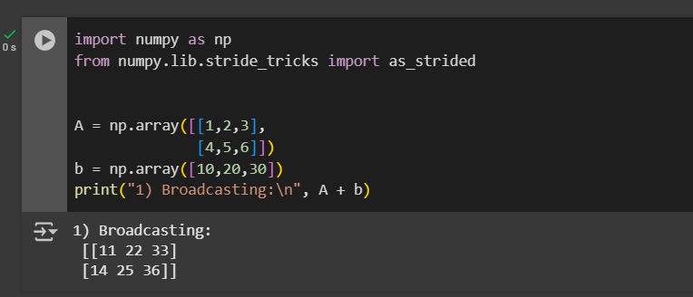

  A. Numpy arreglos

    Como primer paso veremos que son los arreglos y como se pueden aplicar, de esta forma entenderemos para que son y explicaremos de que forma estos se pueden utilizar en difernetes contextos.

    Los arreglos basicamente son una estructura por la que obtendremos formas diversas en las que podremos almacenar datos del mismo tipo, vale la pena mencionar que estas colecciones de datos son sumamente eficientes tanto en su creacion como en su almacenamiento.

    existen dos tipos, vectores y matrices.
    Cada uno de ellos tiene ciertas cualidades y  caracteristicas; por ejemplo los vectores son tecnicamente matrices, sinembargo tienen 1D, asi que se podria decir que son pseudo matrices que pueden ser creadas de manera vertical u horizontal según se desee, las matrices como tal tienen 2D, ahi radica su principal diferencia.
    
    Para empezar vamos a hablar de lo mas básico de la libreria numpy, lo cual es el modo en el que se va a importar la propia libreria, es sumamente sencillo, haremos uso de una simple linea de codigo
    
    * import numpy as np
    Esta simple lina de codigo importa una gran herramienta, nos ahorrará algunos si no muchos dolores de cabeza. en caso que quieras conocer la versión de numpy, debemos usar otra simple linea de codigo.
    * np.__version__

    EJEMPLO 1°

    en este caso podemos ver que la version que fue importada es la 2.0.2

    NUMPY AVANZADO:

    Cuando hablamos de NumPy avanzado, nos   referimos a las características que hacen que NumPy sea mucho más poderoso que una simple librería para crear arreglos. Es entrar en el nivel de optimización, matemáticas y manejo de memoria.

    1-1. Broadcasting

   Significado: NumPy puede operar entre arreglos de distintas dimensiones sin copiarlos.

      Clave: Evita bucles y acelera cálculos.

      Ejemplo: Sumar un vector a cada fila de una matriz automáticamente.

      

    1-2.